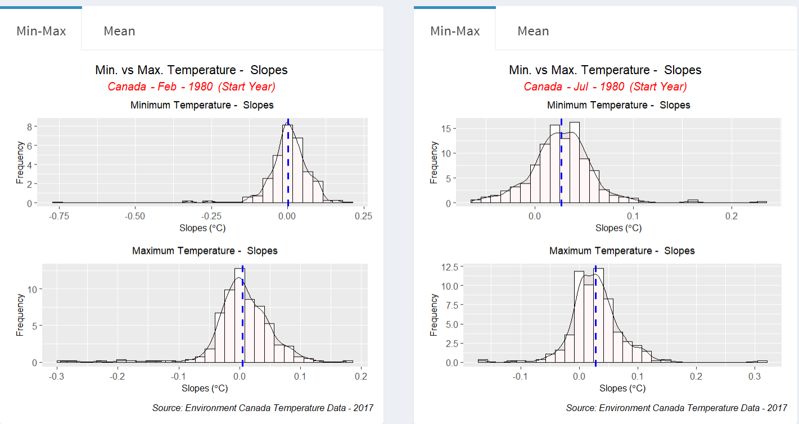
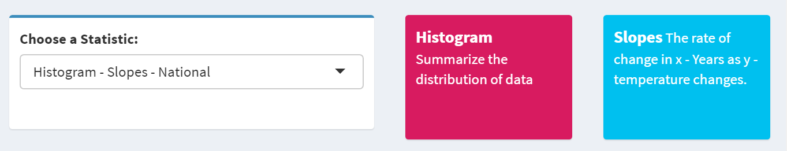
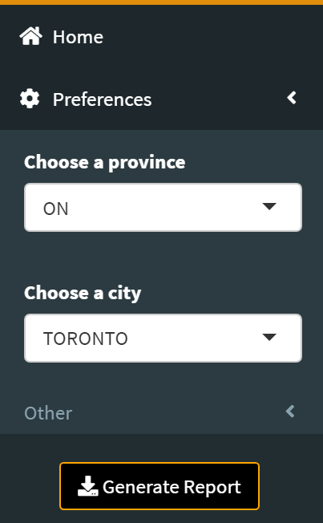
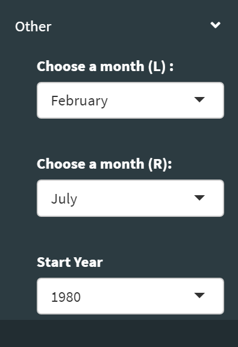
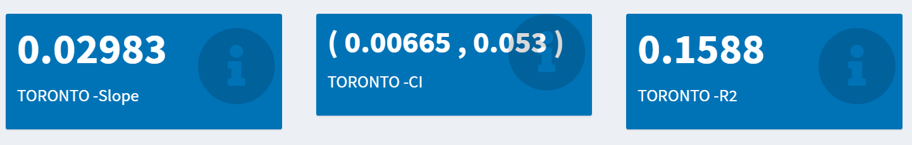
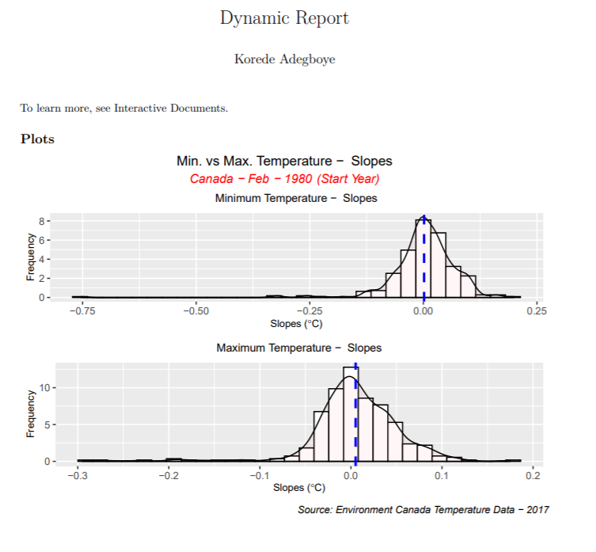

# shinyClimate

> shiny app for climate change 

## Purpose of this App:
This app was designed for two reasons:
- Understand the strength of climate change in a given region 
- provide a family friendly illustration of Canadian climate change - slopes
- give users a trustworthy look at climate trends in their province, (or city)

## Original Data
The original data were produced by [Canada.ca](https://www.canada.ca/en/environment-climate-change/services/climate-change/canadian-centre-climate-services/display-download.html). However, I received it from my Supervisor. Which in turn, sourced from Environment Canada.
As time permitted, only Temperature data was used. Specifically, Second Generation of Homogenized Temperatures for Canada - Update to December 2017. Furthermore, mimimum, maximum and mean monthly temperatures. 
The features included:
- station number 
- city name, province name 
- monthly, annual, and seasonal temperatures

## Data Cleaning 
- led by tidyverse 
- Rename files, by station number, city, province  
- reomve estimated (E) and missing (M) data labels
For more information refer to [data cleaning notebook](docs/data_cleaning.ipynb)

 

## App skeleton
This app is packaged into 4 shiny modules that tightly interact together to pass useful informations. 

## Interface

## Use 
- set working directory to climateApp folder
- Run Command: runApp('R') 
- debugging tool: logj4 - output to debug.log file  

## Features 
- key highlights 
- adjust plot type and statistic by drop down menu
- display dynamic descriptions of whats being displayed 
- adjust province, and/or city for a personal (community) analysis (sidebar<-preferences)
- adjust months, and start year of data (sidebar -> preferences <- other)
- dynamic mean temperature annual slopes,CI and rsquared for a given city 
- download report based on current plots being displayed, using rmarkdown

## Screenshots
### Plot(s) display: 

 

 
 

### Select plot type and statistic 

 

 
 

### Preferences 
 

 
 

### City statistics 
 

 
 

### Downloadable Report 
 

 
 
 
## Further projects
- Expand on story told by the temperature slopes; regional maps
- Include more data; precipation, snow, sea level temperatures
- better report format
Develope family friendly feel
- Random Question & answer of the day
- Trivia 

